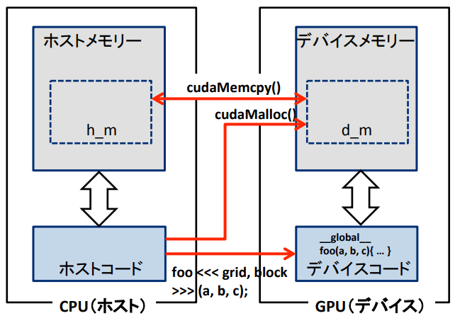
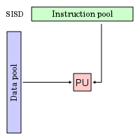
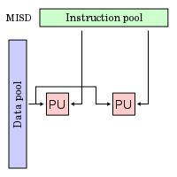
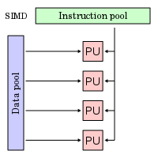
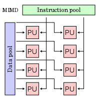

# CUDAプログラミング
## Kernels
CUDA C++は異なるN個のCUDAスレッドでN回の並行処理をC++関数(=カーネル)で定義できる．
CUDAはC++(C)に以下の２つの拡張を加えてある．

1. ホスト(CPU)とデバイス(GPU)間のデータ転送(=`cudaMalloc`->`cudaMemcpy`->`cudaFree`)
2. ホスト側からデバイスに多数のスレッドを処理させる(=カーネル)



ホストから呼び出しデバイス上処理を行うカーネルは`__global__`修飾子で宣言され，`<<<...>>>`構文を使ってCUDAブロック・スレッド数を指定する．`threadIdx`は組み込み変数．

```cpp
__global__ void vectorAdd(float* A, float* B, float* C)
{
    int i = threadIdx.x;
    C[i] = A[i] + B[i];
}

int main()
{
    float *A, *B, *C;
    ...
    // Nスレッドでのカーネル呼び出し
    vectorAdd<<<1, N>>>(A, B, C);
    ...
}
```

## Thread Hierarchy
`threadIdx`は３次元ベクトル(x, y, z)で，`threadIdx.x, threadIdx.y, threadIdx.z`のようにアクセスする．
ブロック(=スレッドブロック)と呼ばれる

### カーネル実行空間修飾子

- `__global__`
  - デバイス上で実行される．
  - ホスト側もしくはデバイスの計算実行可能量が5.0以上のデバイスから呼び出し可能([CUDA Dynamic Parallelism](https://docs.nvidia.com/cuda/cuda-c-programming-guide/index.html#cuda-dynamic-parallelism))．
  - 戻り値は必ず`void`．メンバ関数で指定は不可能．
- `__device__`
  - デバイス上で実行される．
  - デバイス上からのみ呼び出し可能．
- `__host__`
  - ホスト上で実行される．
  - ホスト上からのみ呼び出し可能．

## フリンの分類
フリンの分類は，マイケル・J・フリンが1966年に提案した計算機科学の分野で並列処理に関するコンピュータ・アーキテクチャの分類である．

| 分類                                            | 概要                                                                                                                                                                                                                                                                                             |
| :---------------------------------------------- | :----------------------------------------------------------------------------------------------------------------------------------------------------------------------------------------------------------------------------------------------------------------------------------------------- |
| **SISD**(Single Instruction, Single Data stream)    | 命令にもデータにも並列性がない逐次的なコンピュータ．いわゆるシングルプロセッサマシン．                                                                                                                                                                                                           |
| **SIMD**(Single Instruction, Multiple Data stream)  | 命令列は１つだが，それを複数のデータとストリームに適用する形態のコンピュータ．GPUやベクトル計算機がこれにあたる．                                                                                                                                                                                |
| **MISD**(Multiple Instruction, Single Data stream   | 命令列が複数あり，それを１つのデータストリームに適用する形態のコンピュータ．                                                                                                                                                                                                                     |
| **MIMD**(Multiple Instruction, Multiple Data stream | 複数のプロセッサが同時並行的にそれぞれ異なるデータを異なる命令で処理するコンピュータ．分散システムはMIMD型であると言われ，単一の共有メモリを使う場合と，分散メモリを使う場合がある．近年のPCではマルチプロセッサ，マルチコアを搭載することで，マルチタスクをアプリケーション単位で分散している． |

上記の4つのアーキテクチャを図解すると以下のようになる．`PU`はプロセッシングユニット(処理単位)，`Instruction Pool`は命令プール，`Data Pool`はデータプールを表す．
|               SI-               |               MI-               |       |
| :-----------------------------: | :-----------------------------: | :---: |
|  |  |  -SD  |
|  |  |  -MD  |

### さらなる分類
- **SPMD** (Single Program Multiple Data-streams): 複数のプロセッサが同時並行的に同じプログラムを実行する．ただし，SIMDやMISD(ロックステップ実行)のようにプログラムの同じ箇所ではなく，それぞれ別の箇所を実行し，別々のデータを使用する．
- **MPMD** (Multiple Program Multiple Data): 複数のプロセッサが同時並行的に少なくとも２つ以上の独立したプログラム郡を実行する．

## References
- [CUDA C++ Programming Guide](https://docs.nvidia.com/cuda/cuda-c-programming-guide/)
  - [C++ Language Extensions](https://docs.nvidia.com/cuda/cuda-c-programming-guide/index.html#c-language-extensions)
- [1. CUDAの導入，CUDAの基礎](https://co-crea.jp/wp-content/uploads/2016/07/File_2.pdf)
