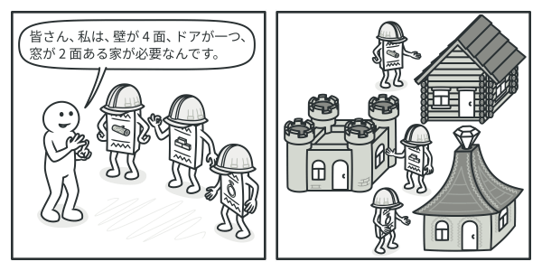

# Builder

- [Builder](https://refactoring.guru/design-patterns/builder)


## :memo: Intent
Builderは、複雑なオブジェクトの段階的に構築できる生成に関するデザインパターンです。
このパターンを使用すると、同じ構築コードを使用して異なる型と表現のオブジェクトを生成することが可能です。

## :confused: Problem
多くのフィールドと入れ子からなり面倒で段階的な初期化が必要なオブジェクトを想像してください。
このような初期化コードは通常、多くのパラメータを持った巨大なコンストラクタの中に埋め込まれています。
最悪の場合、初期化コードはクライアントコードの中のあちこちに分散しています。

<div align="center">

<br>
<em>オブジェクトの可能な全ての構成に対してサブクラスを作成すると、プログラムが過剰に複雑になる可能性がある</em>
</div>

例えば、上のような`House`オブジェクトをどう作成するか考えてみましょう。単純なパターンのみならいいですが、様々なパターンの家を作成したい場合はどうしますか？

最も単純な解決策は、基底の`House`クラスを拡張し、あらゆる組み合わせをカバーする多数のサブクラスを作成することです。こうすると最終的にはとんでもない数のサブクラスが必要になります。また、新しいパラメータを導入するとこの階層はさらに複雑になります。

もう一つのやり方ででは、サブクラスの繁殖は不要です。基底の`House`クラスの中に、オブジェクトに関わるあらゆるパラメータを持った巨大なコンストラクタを作ります。このやり方ではサブクラスの必要性を排除しますが、別の問題が生じます。

<div align="center">

<br>
<em>多数のパラメータを持ったコンストラクタには、常に全てのパラメータが必要なわけでは無いという欠点がある</em>
</div>

多くの場合ほとんどのパラメータは不要であり、**かなり醜いコンストラクタの呼び出し**になります。

## :smile: 解決策
Builderパターンでは、オブジェクトの構築コードを自クラスから抽出して、**ビルダー**と呼ばれる別オブジェクトに移動します。

<div align="center">

<br>
<em>Builderパターンでは、複雑なオブジェクトを1ステップずつ構築する。Builderでは、プロダクト(構築対象物)の構築中に他のオブジェクトがプロダクトにアクセスすることは禁止されている。</em>
</div>

このパターンでは、プロダクトの構築を`buildWalls`、`buildDoor`などの一連のステップに整理します。プロダクトを生成するには、ビルダーオブジェクトに対してこれらのステップを次々に実行します。重要なのは、**全てのステップを呼び出す必要はない**ということです。特定の構成のオブジェクトを生成するためには、それに必要なステップのみを呼び出せば済みます。

様々な種類のプロダクトを構築する必要がある場合、構築ステップのいくつかは、異なる実装を必要とするかもしれません。例えば、小屋の壁は木でできていますが、城壁は石である必要があります。

この場合、同じ一連の構築ステップを異なる方法で実装した複数のビルダークラスを作成することができます。異なる種類のオブジェクトを作り出すためには、これらのビルダーを構築プロセス(一連の決まった順番でのステップ)で使用します。

<div align="center">

<br>
<em>ビルダーは、同じタスクを異なる方法で実行する</em>
</div>

### ディレクター
この考えをさらに勧めて、プロダクト構築に使用する一連の構築ステップへの呼び出しを**ディレクター**と呼ばれる別クラスに抽出することができます。ディレクタークラスは構築ステップを実行する順番を定義し、ビルダーはそのステップの実装を提供します。

<div align="center">

<br>
<em>ディレクターは機能するプロダクトを取得するためにどの構築ステップを実行するべきかを知っている</em>
</div>

ディレクタークラスは厳密には必要ありません。クライアントコードから直接、特定の順番で構築ステップを呼び出せば済みます。しかし、ディレクタークラスは、再利用のために様々なよく使う構築ステップの一連の呼び出しをおいておくにはいい場所かもしれません。
また、ディレクタークラスを使用すると、プロダクト構築の詳細をクライアントコードから完全に隠蔽できます。クライアントはビルダーをディレクターに関連付け、ディレクターを通して構築を開始し、ビルダーから結果を取得するだけです。

```c++
// Product
class House
{
public:
    void addPart(const std::string & part) { parts_.emplace_back(part); }
    void reset() { parts_.clear(); }

private:
    std::vector<std::string> parts_;
};

// Builder interface
// NOTE: it should be define both interface and concrete builders.
class HouseBuilder
{
public:
  void reset() { house_.reset(); }
  void buildWall() { house_.addPart("Wall"); }
  void buildDoor() { house_.addPart("Door"); }
  void buildWindow() { house_.addPart("Window"); }
  void buildRoof() { house_.addPart("Roof"); }
  void buildGarage() { house_.addPart("Garage"); }
  House getResult() const { return house_; }

private:
  House house_;
};

// Director
class HouseDirector
{
public:
  void buildWithGarage(auto & builder) const {
    builder.reset();
    builder.buildWall();
    builder.buildDoor();
    builder.buildWindow();
    builder.buildRoof();
    builder.buildGarage();
  }

  void buildWithoutGarage(auto & builder) const {
    builder.reset();
    builder.buildWall();
    builder.buildDoor();
    builder.buildWindow();
    builder.buildRoof();
  }
};
```

## :computer: Structure

<div align="center">

</div>

1. **ビルダー(Builder)**インターフェースは、全ての型に共通するプロダクト構築の様々なステップを宣言します。
2. **具象ビルダー(Concrete Builder)**は、様々な構築ステップの実装を行います。具象ビルダーは、共通のインターフェース外のプロダクトの産出も可能です。
3. **プロダクト(Product)**は、結果のオブジェクトです。異なるビルダーによって構築された製品は、同じクラス階層やインターフェースに属する必要はありません。
4. **ディレクター(Director)**クラスは、構築ステップを呼び出す順序を定義し、プロダクトの特定の設定を作成して再利用できます。
5. **クライアント(Client)**は、びオブジェクトの一つのディレクターに関連付ける必要があります。通常、ディレクターのコンストラクタのパラメータを介して1回だけ実行されます。その後、ディレクターはそのビルダーオブジェクトをその後の全ての構築に使用します。しかし、クライアントがビルダーオブジェクトをディレクターの産出メソッドに渡すタイミングに関しては、別のやり方もあります。この場合、ディレクターがなにかの産出をするごとに、別のビルダーを使用できます。

## :bulb: Applicability

:lady_beetle: 「望遠的な」コンストラクタを避けるために、Builderパターンを使用します。

:zap: 例えば、10個の省略可能パラメータを持つコンストラクタがあるとします。このような難物を呼び出すことは非常に不便です。従って、コンストラクタを多重定義し、少数パラメータの短縮版を作成します。これらのコンストラクタは、省略されたパラメータの代わりにデフォルト値を元々のコンストラクタに渡します。

```c++
// Creating such a monster is only possible in languages that support method overloading, such as C# or Java.
class Pizza {
public:
  Pizza(int size) { ... }
  Pizza(int size, bool cheese) { ... }
  Pizza(int size, bool cheese, bool pepperoni) { ... }
};
```
Builderパターンで、必要なステップのみを使用して、オブジェクトを段階的に作成できます。このパターンを適用すれば、コンストラクタに複数のパラメータを詰め込む必要がなくなります。

---

:lady_beetle: ご自分のコードで異なる表現のプロダクト （石や木製の家など） を作成したい場合に、 Builder パターンを使ってください。

:zap: Builder パターンは、製品の様々な表現の構築において、詳細のみが異なる同様のステップが含まれる場合に適用できます。

基底のビルダー・インターフェースは、すべての可能な構築ステップを定義し、具象ビルダーは、プロダクトの特定の表現を構築するために、これらのステップを実装します。一方、 ディレクター・クラスは、構築の順序を手引きします。

---

:lady_beetle: [Composite](../../structual/composite/README.md)ツリーなどの複雑なオブジェクトの構築に、Builderを適用してください。

:zap: Builder パターンでは、プロダクトを段階的に構築します。いくつかのステップの実行を遅らせても、最終的プロダクトは、 問題なく機能します。ステップを再帰的に呼び出すことも可能で、オブジェクト・ツリーの構築時に便利です。

ビルダーは、構築ステップの実行中の未完成のプロダクトを外部に公開しません。これにより、クライアントのコードが不完全な結果を取得することを防ぎます。

## :anchor: Pros and Cons

:white_check_mark: 段階的にオブジェクトを作成したり、構築ステップを遅延させたり、再帰的にステップを実行することが可能。
:white_check_mark: プロダクトの様々な表現の作成に際して、同じ構築コードの再利用が可能。
:white_check_mark: 単一責任の原則(*Single responsibility Principle*)。複雑な構築用コードを、プロダクトのビジネスロジックから分離可能。

:x: 本パターンでは、複数の新規クラス作成の必要があるため、コードの全体的な複雑さが増加。

## :arrows_counterclockwise: Relations with Other Patterns

- 多くの設計は、まず比較的単純でサブクラスによりカスタマイズ可能な、**[Factory Method](../factory-method/README.md)**から始まり、次第に、もっと柔軟だが複雑な**Abstract Factory**や**[Prototype](../prototype/README.md)**や**Builder**へと発展していきます。
- **Builder**は、複雑なオブジェクトを段階的に構築することに重点をおいています。**Abstract Factory**は、関連するオブジェクトの集団を作成することに特化しています。*Abstract Factory*がすぐにプロダクトを返すのに対して、*Builder*ではプロダクトの取得前に、いくつかの追加の構築ステップを踏まなければなりません。
- **Builder**は、複雑な**[Composite](../../structual/composite/README.md)**ツリー作成に使用できます。構築ステップを再帰的に行うようにプログラムします。
- **Builder**と**[Bridge](../../structual/bridge/README.md)**を組み合わせることがでいます。ディレクタークラスは抽象仮想の役割を果たし、ビルダーは実装です。
- **Abstract Factory**、**Builder**、**Prototype**はどれも**[Singleton](../singleton/README.md)**で実装可能です。