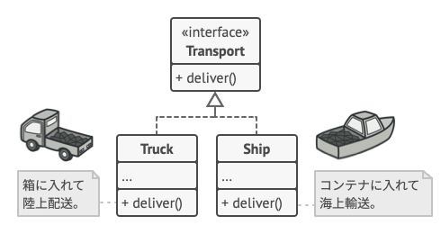
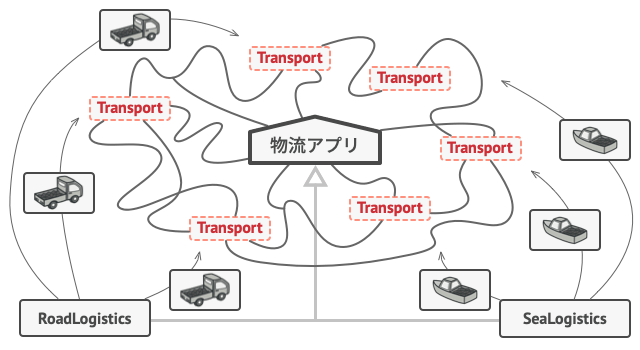

# Factory Method

- [Factory Method](https://refactoring.guru/design-patterns/factory-method)

> [!TIP]
> a.k.a : Virtual Constructor

## 📝 Intent
Factory Methodは、生成に関するデザインパターンの一つで、スーパークラスでオブジェクトを生成するためのインターフェイスを用意する。
しかし、サブクラスでは生成されるオブジェクトの型の変更をすることができる。

## 😕 Problem
物流管理アプリケーションを作成するとします。アプリの最初のバージョンはトラック輸送のみを処理できます。こーどの大部分は`Truck`クラス内に存在します。

しばらくして、このアプリに海上物流を導入する要望が寄せられるようになりました。
現状では、コードの殆どは`Truck`クラスに結合されているため、`Ships`クラスを追加するには多くの変更が必要です。
また、今後アプリに別の輸送手段を追加したい場合も同様の変更が必要になります。

## 😄 Solution
Factory Methodパターンに従うと、`new`演算子を使用した直接のオブジェクト作成呼び出しを、特別なファクトリー・メソッドへの呼び出しで置き換えます。具象クラスは`new`演算子で作成されるますが、それらのファクトリー・メソッド内で呼び出されます。ファクトリー・メソッドから返されるオブジェクトは**プロダクト**と呼ばれます。

<div align="center">

</div>

```c++
/**
 * The *Product* interface declares the operations that all concrete products must implement.
 */
class Transport {
public:
  virtual ~Transport() {};
  virtual std::string deliver() const = 0;
};

/**
 * Concrete *Products* provide various implementations of the product interface.
 */
class Truck : public Transport {
public:
  std::string deliver() const override {
    return "{Result of delivery with the truck}";
  }
};
class Ship : public Transport {
public:
  std::string deliver() const override {
    return "{Result of delivery with the ship}";
  }
};

/**
 * The *Creator* class declares the factory method that is supposed to return an object of a *Product* class.
 * The *Creator's* subclasses usually provide the implementation of this method.
 */
class Logistics
{
public:
  std::string doDelivery() const {
      Transport * t = createTransport();
      return t->deliver();
  }

  /**
   * The *Factory Method*.
   * 
   * [NOTE] it is better to use the smart pointer than the new operator.
   */
  virtual Transport * createTransport() const = 0;
};

/**
 * Concrete *Creators* override the factory method in order to change the resulting type of product.
 */
class RoadLogistics : public Logistics
{
public:
  Transport* createTransport() const override {
    return new Truck();
  }
};
class SeaLogistics : public Logistics
{
public:
  Transport* createTransport() const override {
    return new Ship();
  }
};
```

一見すると、この変更はコンストラクタの呼び出しをプログラムのある部分から別の部分に移動しただけに見えます。
しかし、これにより、サブクラスのファクトリー・メソッドを上書きさえすれば作成されるプロダクトのクラスの変更が可能というメリットがあります。

しかし、僅かな制限があります。
1. これらのプロダクトに共通のベースクラスまたはインターフェイスがある場合にのみ、サブクラスは、異なる方のプロダクトを返すことができます。
2. ベースクラス内のファクトリー・メソッドの戻り値の型は、このインターフェイスとして定義されている必要があります。

<div align="center">

</div>

例えば、`deliver`というメソッドが宣言された`Transport`というインターフェイスを、`Truck`と`Ship`の両クラスが実装します。Truckは陸上で、Shipは海上で貨物を届けるというように、それぞれのクラスでこのメソッド実装が異なっています。
`RoadLogistics`クラスのファクトリー・メソッドはTruckオブジェクトを返し、`SeaLogistics`クラスのファクトリー・メソッドはShipを返します。

<div align="center">

</div>

ファクトリー・メソッドを使用するコード(**クライアントコード**)からは、様々なサブクラスが返す実際のプロダクトの間に違いは見られません。クライアントは全てのプロダクトを`Transport`として扱います。クライアントは、全ての`Transport`オブジェクトが`deliver`メソッドを持っていることは知っていますが、それが厳密にどのように振る舞うかは、クライアントにとって重要なことではありません。

> [!TIP]
> このProductとCreatorの関係はTensorRTのカスタムプラグイン実装でも同じパターンで実装されている。
> > **Product = CustomPlugin、Creator = CustomPluginCreator**

## 💻 Structure

<div align="center">

</div>

## 💡 Applicability

🐞 クライアントがコードで処理する正確な型と依存関係が事前にわからない場合は、Factory Methodを使います。

⚡ Factory Methodでは、プロダクト作成のコードを実際にプロダクトを使用するコードから分離します。したがって、プロダクト作成のコード拡張が残りのコードから独立して簡単に行えます。

例えば、アプリに新しいプロダクトの型を追加するには、Creatorクラスの新しいサブクラスを作成し、その中のファクトリー・メソッドを上書きするだけで済みます。

---

🐞 自分の書いたライブラリやフレームワークのユーザーに内部のコンポーネントを拡張する方法を提供したい場合、Factory Methodを使用します。

⚡ ライブラリやフレームワークのデフォルト動作を拡張する最も簡単な方法は、恐らく継承です。しかし、フレームワークは、標準コンポーネントの代わりにサブクラスを使用するべきだということをどう認識するのでしょうか？

解決策は、フレームワークの中に散らばった、コンポーネント構築コードを削減し、単一のファクトリー・メソッドに集めることです。こうすれば、コンポーネント自体を拡張することに加えて、誰でもこのメソッドを上書きできます。

それでは、それがどううまくいくのか見てみましょう。あるオープン・ソースのUIフレームワークを使ってアプリを書くことを想像してください。アプリには丸いボタンが必要ですが、フレームワークには四角いボタンしか提供していません。そこで、標準の`Button`クラスを拡張して、`RoundButton`サブクラスを作成します。しかし、ここで、デフォルトのボタンの代わりに新しいボタンのサブクラスを使用するように、メインの`UIFramework`クラスに伝える必要が出てきます。

そのためには、フレームワークの基底クラスから`UIWithRoundButtons`というサブクラスを作り、その`createButton`メソッドを上書きします。このメソッは基底クラスでは`Button`オブジェクトを返しますが、サブクラスでは`RoundButton`オブジェクトを返すようにします。ここで、`UIFramework`の代わりに`UIWithRoundButtons`クラスを使用してください。それだけです！


```c++
#include <UIFrameWork.hpp>  // some UI framework

/**
 * A subclass of `Button` product that overrides `render` and `onClick` methods.
 */
class RoundButton : public Button {
public:
  void render() const override { /* Render the round button*/ }
  void onClick() const override { /* Do something when the button is clicked*/ }
};

/**
 * A subclass of `UIFramework` creator that overrides `createButton` in order to create `RoundButton`.
 */
class UIWithRoundButton : public UIFramework
{
    Button * createButton() const override {
        return new RoundButton();
    }
};
```

---

🐞 毎回再構築する代わりに、既存オブジェクトを再利用してシステム資源を節約したい場合に、Factory Methodを使用します。

⚡ データベース接続、ファイルシステム、ネットワーク資源等、資源を大量に消費するオブジェクトを扱う場合に、このような状況によく直面します。

オブジェクトの再利用のために何をしなければ行けないかを考えてみましょう。

1. まず、作成された全てのオブジェクトを追跡するための記録場所を作成する必要があります。
2. 誰かがオブジェクトを要求してきたら、プログラムはそのプール(蓄積地)内の空きオブジェクトを探す必要があります。
3. そして、クライアントのコードに対して見つかったオブジェクトを返します。
4. 再利用可能なオブジェクトが無い場合、プログラムは新しいオブジェクトを作成し、そしてプールに追加する必要があります。

これは結構な量のコードになります！重複したコードでプログラムを汚染しないように、このコードは一箇所に収めるべきです。
おそらく、このコードを置くべき最も明白で便利な場所は、オブジェクトの再利用をしたいクラスのコンストラクタ内です。しかし、コンストラクタは定義により常に**新規オブジェクト**を返さなければならず、既存インスタンスを返すことはできません。

というわけで、新規オブジェクト作成も既存オブジェクトの再利用もできる**通常メソッド**が必要になります。これは、ファクトリー・メソッドのように聞こえますね。

```c++
#include <vector>
#include <algorithm>
#include <string>
#include <iostream>

class Product {
public:
  Product(const std::string &name) : name_(name) {}

  const std::string & name() const { return name_; }

private:
  std::string name_;
};

class Creator {
public:
  Product *createProduct(const std::string &name) const {
    std::cout << "Create: " << name << std::endl;
    return new Product(name);
  }
};

class Application {
public:
  Application() {}

  void run(const std::string &name) {
    // Create product only if the pool does not contain the product with a
    // specified name
    if (std::find_if(products_.cbegin(), products_.cend(), [&](const auto & p) { return p.name() == name; }) == products_.cend()) {
      auto product = creator_.createProduct(name);
      products_.emplace_back(*product);
    }
  }

private:
  Creator creator_;
  std::vector<Product> products_; // Pool of products
};

int main()
{
  Application app;
  app.run("foo");
  app.run("foo"); // In this line, a Product named `foo` will not be created
}
```

## :anchor: Pros and Cons

✅ クリエーターと具象プロダクト間の密な結合を避けます。
✅ 単一責任の原則(*Single Responsibility Principle*)。プロダクト作成コードがプログラムの一箇所にまとめられ、保守が用意。
✅ 開放閉鎖の原則(*Open/Closed Principle*)。既存のクライアントコードに影響なく新しいプロダクトを導入することが可能。

❌ 本パターンの適用では、多数の新規サブクラスを導入する必要があり、コードの複雑化の恐れがあります。既存のクリエータークラスの階層にこのパターンを適用する場合が最善である。

## :arrows_counterclockwise: Relations with Other Patterns

- 多くの設計は、まず比較的単純でサブクラスでカスタマイズ可能な**Factory Method**から始まり、次第にもっと柔軟だが、複雑な**[Abstract factory](../abstract-factory/README.md)**や**[Prototype](../prototype/README.md)**や**[Builder](../builder/README.md)**へと発展していきます。
- **Abstract Factory**クラスは、多くの場合Factory Methodの集合だが、Prototypeを使ってメソッドを書く個もできます。
- Factory Methodを**[Iterator](../../behavioral/iterator/README.md)**と一緒に使って、コレクションのサブクラスが、コレクションと互換な、異なる型のイテレータを返すようにできます。
- Prototypeは継承に基づいてないので、継承の欠点はありません。一方で、クローンされたオブジェクトの複雑な初期化が必要になります。Factory Methodは継承に基づいており、初期化のステップは必要ありません。
- Factory Methodは、**[Template Method](../../behavioral/template-method/README.md)**の特別な場合です。同時に、Factory Methodは、大きなTemplate Methodの一つのステップとして使うこともできます。