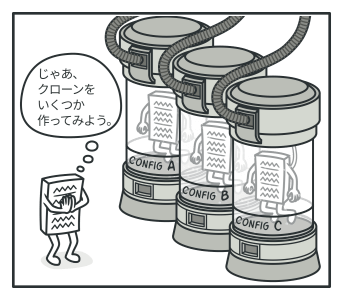

# Prototype

- [Prototype](https://refactoring.guru/design-patterns/prototype)

## 📝 Intent
Prototypeは、既存オブジェクトのコピーをそのクラスに依存すること無く可能とする、生成に関するデザインパターンです。

## 😕 Problem

ここにオブジェクトがあって、この正確なコピーを作成したいとします。どうすればいいでしょう？ まず、同じクラスの新規オブジェクトを作成する必要があります。次に、元のオブジェクトのすべてのフィールドの値を一つずつ新しいオブジェクトにコピーしていきます。

よさそうですね！でも落とし穴があります。どんなオブジェクトでもこの方法でコピーできるわけではないのです。オブジェクトのフィールドの一部は `private`（非公開）で、オブジェクトの外からは見えないようになっているかもしれません。

 
<em>外部からのオブジェクトをコピーすることは常に可能とは限りません</em>

この直接的なやり方には、もう一つの問題があります。複製を作成するには、オブジェクトのクラスについてよく知っている必要があるので、コードはそのクラスに依存するようになります。余分な依存関係なんてへっちゃらという方には、もう一つ別の落とし穴があります。オブジェクトが従うインターフェースは知っているが、具象クラスは知らない、という場合があります。例えば、あるメソッドはパラメータとして、あるインターフェースに従うどんなオブジェクトも受け取るといった場合です。

## 😄 Solution

このパターンでは、クローン（複製）される実際のオブジェクトにクローン作成の作業が任されます。クローンをサポートするすべてのオブジェクトに対する共通インターフェースを宣言します。このインターフェースを使用すると、コードをそのオブジェクトのクラスに密に結合せずにオブジェクトのクローン作成ができます。**通常、この手のインターフェースは、 `clone`メソッド一つだけからなっています。**

クローン作成をサポートするオブジェクトは、**プロトタイプと呼ばれます。**オブジェクトに数十のフィールドと数百の可能な構成がある場合、サブクラスを作る代わりにクローン作成が有効な代替手段となるかもしれません。

 
<em>事前に構築されたプロトタイプはサブクラス化の代替手段</em>

仕組み：様々な構成のオブジェクトをあらかじめ作成しておきます。これら構成ずみオブジェクトの一つに似たオブジェクトが必要な場合、新しいオブジェクトを一から構築する代わりにプロトタイプをクローンします。

## 💻 Structure

### Basic implementation

1. **プロトタイプ(Prototype)**インターフェースはクローン作成メソッドを宣言します。ほとんどの場合、ただ一つの`clone`メソッドからできています。
2. **具象プロトタイプ(Concrete Prototype)**のクラスは、クローン作成メソッドを実装します。元のオブジェクトのデータをコピーするだけでなく、このメソッドはクローン作成時にクローン同士をリンクするとか、再帰的依存関係を取り払うなどの作業を行うかもしれません。
3. **クライアント(Client)**は、プロトタイプのインターフェースに従うどんなオブジェクトでも、そのコピーを作成できます。

### Prototype registry implementation

1. **プロトタイプ・レジストリー(Prototype Registry)**により、よく使われるプロトタイプに簡単にアクセスできます。そこには、いつでも複製可能な状態の構築済みオブジェクトが蓄えられています。一番簡単な実装方法は、`名前: プロトタイプ`のハッシュマップを使うことです。しかし、単に名前に頼る以上の検索方法が必要な場合は、もっと堅牢なレジストリーを作ることも可能です。

### 💡 Applicability

🐞 自分のコードがコピー対象オブジェクトの具象クラスに依存したくない場合に、Prototypeパターンを使用します。

⚡ この状況は、自分のコードが何らかのインターフェースを介して渡された外部開発コードからのオブジェクトと動作する場合によく発生します。これらのオブジェクトの具象クラスは不明であり、仮に望んでもそれに依存することはできません。

Prototype パターンを適応すると、クライアントのコードは、クローンをサポートするすべてのオブジェクトを扱う一般的なインターフェースを使います。このインターフェースにより、クライアントのコードは、クローン対象オブジェクトの具象クラスから独立したものとなります。

---

🐞 オブジェクトの初期化方法のみが異なるサブクラスの数を減らしたい場合に、このパターンを使用します。

⚡ 使用する前に手の込んだ設定を必要とする複雑なクラスがあるとします。このクラスを設定するには、 いくつかの共通する方法がありますが、それはアプリのあちこちに散らばっています。重複を減らすために、複数のサブクラスを作成し、共通設定コードをサブクラスのコンストラクターに入れます。重複問題を解決しましたが、今度はダミーのサブクラスがたくさんできました。

Prototype パターンでは、いろいろな方法で事前構築したオブジェクトを使うことができます。何かの構成に一致するサブクラスをインスタンス化する代わりに、クライアントは適切なプロトタイプを探してクローンするということができます。

## ⚓ Pros and Cons

✅ 具象クラスと密に結合せずにオブジェクトのクローンが可能
✅ 構築済みのプロトタイプのクローン作成を使うことにより、初期化コードの重複を削減
✅ 複雑なオブジェクトの生成がより便利
✅ 複雑なオブジェクトに対する事前設定を扱う上で継承に代わる方法を提供

❌ [循環参照](https://qiita.com/hmito/items/9b35a2438a8b8ee4b5af#%E5%BE%AA%E7%92%B0%E5%8F%82%E7%85%A7)のある複雑なオブジェクトのクローン作成は一筋縄ではいかない場合あり。

## 🔄 Relations with Other Patterns

- 多くの設計は、まず比較的単純でサブクラスによりカスタマイズ可能な、**[Factory Method](../factory-method/README.md)**から始まり、 次第に、もっと柔軟だが複雑な**[Abstract Factory](../abstract-factory/README.md)**や**Prototype**や**[Builder](../builder/README.md)**へと発展していきます。
- **Abstract Factory**クラスは、多くの場合**Factory Method**の集まりですが、**Prototype**を使ってメソッドを書くこともできます。
- **Prototype**は継承に基づいていないので、継承の欠点はありません。一方、**Prototype**は、クローンされたオブジェクトの複雑な初期化が必要となります。**Factory Method**は継承に基づいていますが、初期化のステップは必要ありません。
- 場合によっては、**Prototype**を**[Memento](../../behavioral/memento/README.md)**の代わりに使用した方が簡単な場合があります。状態の履歴を保存したいオブジェクトが比較的単純で、他の外部リソースへのリンクを持たないか簡単に再現できる場合に、この方法が使えます。
- **Abstract Factory**、**Builder**、**Prototype**はどれも**[Singleton](../singleton/README.md)**で実装可能です。