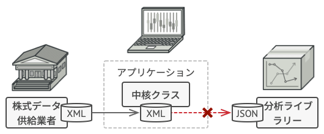
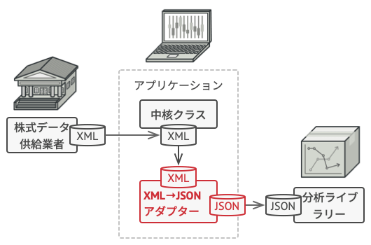

# Adapter

## 📝 Intent

Adapterは構造に関するデザインパターンの一つで、非互換なインターフェースのオブジェクト同士の協働を可能にします。

## 😕 Problem

株式市場監視アプリを作成することを想像してみてください。このアプリは、複数の情報源からXML形式の株式データをダウンロードし、見栄えのいいグラフや図表をユーザーに表示します。
ある時点で、外部提供の気の利いた分析ライブラリを統合してアプリを改善することに決めました。ただし、一つの問題があります。分析ライブラリは、JSON形式のデータでのみ機能するということです。

<div align="center">

<br>
<em>分析ライブラリは自分のアプリとは非互換な形式のデータしか受け付けないのでそのままでは使用できない</em>
</div>

XMLで動作するようにライブラリを変更することもできます。ただそうすると、ライブラリに依存した既存のコードが動かなくなる可能性があります。さらに、そもそもライブラリのソースコードが入手できない可能性があり、その場合この手法はうまく行きません。

## 😄 Solution

アダプターを作成します。これは、あるオブジェクトのインターフェースを他のオブジェクトが理解できるように変換する特殊なオブジェクトです。

アダプターは、オブジェクトをラップして、舞台裏で行われる変換の詳細を隠蔽します。ラップされたオブジェクトは、アダプター内で動作しているということすら認識していません。たとえば、メートルとキロメートルで動作するオブジェクトを、すべてのデータをフィートやマイルに変換するアダプターでラップすることができます。

アダプターは、データの形式変換だけだけではなく、異なるインターフェースのオブジェクト同士の協働を可能とします。仕組みは次のとおりです。

1. アダプターは、既存オブジェクトの一つと互換なインターフェースを実装します。
2. このインターフェースを使用して、既存オブジェクトはアダプターのメソッドを安全に呼び出すことができます。
3. 呼び出されると、アダプターはリクエストを２つ目のオブジェクトに渡します。ただし、２つ目のオブジェクトが期待する形式で渡します。

ときには、呼び出しを双方向に変換できる双方向アダプターを作成することも可能です。

<div align="center">

</div>

## 💻 Structure

### オブジェクト・アダプター

この実装では、オブジェクトの合成原理を使用します。アダプターは一方のオブジェクトのインターフェースを実装し、もう一方のオブジェクトをラップします。これは、一般的に普及しているすべてのプログラミング言語で実装可能です。

<div align="center">

</div>

1. **クライアント(Client)** は、既存のビジネスロジックを含んだクラスです。
2. **クライアント・インターフェース(Client Interface)** は、クライアント側コードと協働するために従わなければいけないプロトコル(=決まりごと)を記述しています。
3. **サービス(Service)** は、外部から提供されるか、昔から使われてきた、ある役に立つクラスです。このクラスは、非互換のインターフェースのため、クライアントから直接使うことができません。
4. **アダプター(Adapter)** は、クライアントとサービスの両方と機能できるコードです。クライアント・インターフェースを実装すると同時にサービス・オブジェクトをラップします。アダプターは、アダプターのインターフェースを介してクライアントから呼び出され、それをラップされたサービス・オブジェクトが理解できる形式に変換して呼び出します。
5. クライアント側コードは、クライアント・インタフェースを介してアダプターとやりとりする限り、具象アダプター・クラスと結合されることはありません。このおかげで、新しい種類のアダプターをプログラムに導入しても既存のクライアント側コードは問題なく動作します。これは、サービス・クラスのインターフェースを変更したり置き換えたりする際に便利です。クライアント側コードを変更することなく、新しいアダプター・クラスを作成することができます。

---

### クラス・アダプター

この実装では継承を利用します。アダプターは、両方のオブジェクトのインターフェースを同時に継承します。この方法は、C++のような多重継承をサポートするプログラミング言語でのみ実装可能であることにご注意ください。

<div align="center">

</div>

1. **クラス・アダプター** では、オブジェクトをラップする必要がありません。クライアントとサービスの両方から振る舞いを継承するからです。適合(変換)は、上書きされたメソッドの間で行われます。完成したアダプターは、既存のクライアント側クラスの代わりに使うことができます。

## # Pseudo Code

このAdapterパターンの使用例は、矛盾の典型である「丸い穴に四角い杭」に基づいています。

<div align="center">

<br>
<em>四角い杭を丸い穴に適応中</em>
</div>

アダプターは、半径が四角の対角線の半分の長さ(言い換えると、四角い杭を含むことのできる最小の円の半径)である丸い杭のフリをします。

```c++
// RoundPegとRoundHoleは互換なクラス
class RoundPeg {
public:
    RoundPeg(const double radius) : radius_(radius) { /* ... */ }
    double getRadius() const { return radius_; }
private:
    double radius_;
};

class RoundHole {
public:
    RoundHole(const double radius) : radius_(radius) { /* ... */ }
    double getRadius() const { return radius_; }
    bool fits(const RoundPeg & peg) const { return getRadius() >= peg.getRadius(); }
private:
    double radius_;
};

// SquarePegは非互換なクラス
class SquarePeg {
public:
    SquarePeg(const double width) : width_(width) { /* ... */ }
    double getWidth() const { return width_; }
private:
    double width_;
};

// アダプタークラスを使えば、四角い杭を丸い穴に合わせられる。RoundPegクラスを拡張して
// アダプターオブジェクトが丸い杭として機能。
class SquarePegAdapter : public RoundPeg
{
public:
    SquarePegAdapter(const SquarePeg & peg) : peg_(peg) { /* ... */ }
    double getRadius() const { return peg_.getWidth() * std::sqrt(2) * 0.5; }
private:
    SquarePeg peg_;
};

int main() {
    RoundHole hole(5);
    RoundPeg rpeg(5);
    hole.fits(rpeg);

    SquarePeg small_sqpeg(5);
    SquarePeg large_sqpeg(5);
    // hole.fits(small_sqpeg); // Compile Error

    SquarePegAdapter small_sqpeg_adapter(small_sqpeg);
    SquarePegAdapter large_sqpeg_adapter(large_sqpeg);
    hole.fits(small_sqpeg_adapter);
    hole.fits(large_sqpeg_adapter);
}
```

## 💡 Applicability

🐞 Adapterクラスは、既存のクラスを使用したいが、そのインターフェースが自分のコードの他の部分と互換性がない場合に使用します。

⚡ Adapterパターンでは、自分のクラスと、昔から引き継がれてきたクラスや外部提供のクラスや奇妙なインターフェースのクラスとの間で翻訳者として機能する中間層のクラスを作成します。

---

🐞 既存のいくつかのサブクラスを再利用したいが、スーパークラスに追加できる共通機能がかけている場合に、このパターンを使用します。

⚡ それぞれのサブクラスを拡張して、新しい子クラスに欠けている機能を追加する、ということも可能です。しかし、すべての新規クラスにコードの複製が必要となります。これは、**なにか怪しげな匂い** がします。

もっとエレガントな解決策は、足りない機能をアダプタークラスに入れることです。そして、機能の欠落したオブジェクトをアダプタークラスでラップし、必要な機能を動的に追加します。これを実現するためには、対象となるクラスは共通のインターフェースを持ち、アダプターのフィールドがそのインターフェースに従う必要があります。この手法は、**Decorator** パターンに非常によく似ています。

## ⚓ Pros and Cons

✅ 単一責任の原則(*Single Responsibility Principle*)。インターフェースやデータ変換のコードを、プログラムの主要なビジネスロジックから分離可能。
✅ 開放閉鎖の原則(*Open/Closed Principle*)。クライアントインターフェースを介してアダプターと連携する限り、既存のクライアント側コードを壊すことなく、新しい種類のアダプターをプログラムに追加可能。
❌ 一連の新規のインターフェースとクラスを追加する必要があるため、全体的なコードの複雑性が増加。コードの他の部分と一致するようにサービスクラスを書き直すほうが単純でいい場合あり。

## 🔄 Relations with Other Patters

- **[Bridge](../bridge/README.md)** は通常、アプリケーションの部分部分を独立して開発できるように、設計当初から使われます。一方、**Adapter** は、既存のアプリケーションに対して利用され、本来は互換性のないクラスとうまく動作させるために使われます。
- **Adapter**はラップされたオブジェクトに対して新しいインターフェースを定義するのに対し、**[Proxy](../proxy/README.md)**は同じインターフェースを提供し、**[Decorator](../decorator/README.md)**は強化したインターフェースを提供します。
- **[Facade](../facade/README.md)**が既存のオブジェクトに対して新しいインターフェースを定義するのに対し、**Adapter**は既存のインターフェースを使えるように使用とするものです。Adapterは通常一つのオブジェクトだけを包み込みますが、Facadeは複数のオブジェクトからなるサブシステム全体を相手にします。
- **[Bridge](../bridge/README.md)**、**[State](../../behavioral/state/README.md)**、**[Strategy](../../behavioral/strategy/README.md)**(と限られた意味合いでは、**Adapter**)も、非常によく似た構造をしています。実際のところ、これらのすべてのパターンは、合成に基づいており、仕事を他のオブジェクトに委任します。しかしながら、違う問題を解決します。パターンは、単にコードを特定の方法で構造化するためのレシピではありません。パターンが解決する問題に関して、開発者同士がするコミュニケーションの道具でもあります。