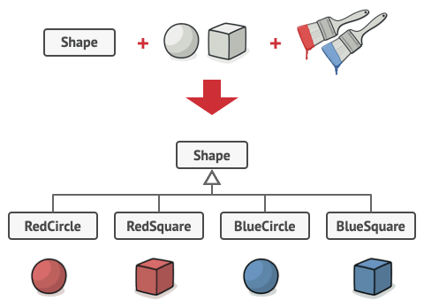
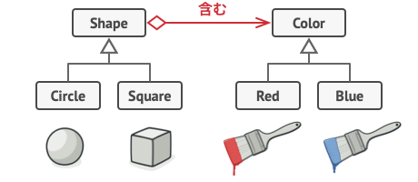
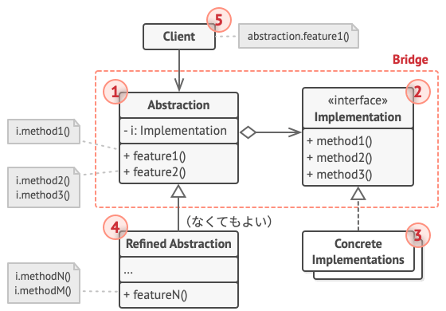

# Bridge

## 📝 Intent

Bridgeは巨大なクラスや密接に関連するクラスの集まりを抽象部と実装部に分離し、それぞれが独立に開発できるようにします。

## 😕 Problem

抽象化？実装？なんだか怖そう？心配不要、簡単な例を見てみましょう。

幾何的な形状を表す`Shape`クラスが`Circle`と`Square`をサブクラスとして持っています。
これらのクラスを拡張して色という要素を組み込むために、`Red`と`Blue`の形状クラスを作りたいとします。
しかしすでに２つのクラスがあるため、これらの組み合わせで`BlueCircle`や`RedSquare`といった合計4つのクラスを作る必要があります。

<div align="center">

<br>
<em>クラスの組み合わせ数は幾何的な速さで増加する</em>
</div>

クラス階層に新しい形状と色を加えるとそれは指数関数的に増加します。例えば、三角形を追加するにはそれぞれ色に1つずつ、計2つのサブクラスを導入する必要があります。

## 😄 Solution

Bridgeパターンでは、継承からオブジェクトの合成に切り替えることでこの問題を解決しようとします。つまり、次元のいずれか一つを別のクラス階層に抽出するということです。一つのクラス内にすべての状態と振る舞いを持つ代わりに、元のクラスは、新しい階層のオブジェクトを参照するようにします。

<div align="center">

<br>
<em>クラス階層の膨張を防ぐために、いくつかの関連する階層に変換する</em>
</div>

### Abstraction and Implementation

GoF本には*抽象化(Abstraction)*と*実装(Implementation)*という用語がBridgeの定義の一部として使われています。
抽象化(インターフェースともいう)は、ある項目の高レベルな制御層です。この階層は実際の処理は行われず、処理は、実装層(プラットフォームともいう)に移譲されます。

## 💻 Structure

<div align="center">

</div>

1. **抽象化層(Abstraction)**は、高レベルの制御ロジックを提供します。実際の低レベルの作業は実装オブジェクトに任されます。
2. **実装(Implementation)**は、すべての具象実装に共通のインターフェースを宣言します。抽象化層は、ここで宣言されたメソッドを介してのみ実装オブジェクトと通信することができます。
3. **具象的実装(Concrete Implementation)**には、プラットフォーム固有のコードが含まれています。
4. **整った抽象化(Refined Abstraction)**は、制御ロジックの変種を提供します。親と同様に、一般的な実装インターフェースを介して各種の異なる実装を使います。
5. 通常、**クライアント(Client)**は、抽象化層とだけやり取りをします。しかし、抽象化層のオブジェクトと実装オブジェクトを結びつけるのは、クライアントの仕事です。

## # Pseudo Code

`Device`系のクラスは実装として機能し、`Remote`系のクラスは抽象化層です。

<div align="center">

</div>

基底のリモコンクラスは、機器オブジェクトへ結びつけるための参照フィールドを宣言しています。
すべてのリモコンは、機器とのやり取りを一般的な機器インターフェースを介して行い、同じリモコンで複数の種類の機器をサポートできます。

リモコンクラスの開発は、機器クラスと独立して行えます。行うべきことは、新しいリモコンのサブクラスを作成することだけです。

```c++
/**
 * 抽象化層は、２つのクラス階層の「Control」関係のインターフェースを定義。
 * これは、「実装」階層のオブジェクトへの参照を維持し、実際の作業のすべてをこのオブジェクトに委任。
 */
class RemoteControl {
protected:
    Device device_;

public:
    RemoteControl(const Device & device) : device_(device) { /* ... */ }

    void togglePower() {
        if (device.isEnabled()) {
            device.disable();
        } else {
            device.enable();
        }
    }

    void volumeDown() {
        auto volume = device.getVolume();
        device.setVolume(volume - 10);
    }

    void volumeUp() {
        auto volume = device.getVolume();
        device.setVolume(volume + 10);
    }

    void channelDown() {
        auto channel = device.getChannel();
        device.setChannel(channel - 1);
    }

    void channelUp() {
        auto channel = device.getChannel();
        device.setChannel(channel - 1);
    }
};

// 抽象化層のクラスは、Device系クラスとは独立して拡張可能。
class AdvancedRemoteControl : public RemoteControl
{
public:
    void mute() { device.setVolume(0); } 
}

// 「実装」インターフェースは、全具象実装クラスに共通するメソッドを定義。
// 抽象層インターフェースと一致する必要なし。実際のところ、この２つは全く異なって良い。
// 典型的には、実装インターフェースは基礎的な操作を宣言し、抽象仮想は基礎的操作に基づいて
// 高レベルな操作を定義。
class Device
{
public:
    bool isEnabled() const { /* */ }
    void enable() { /* */ }
    void disable() { /* */ }
    int getVolume() const { /* */ }
    void setVolume(int percent) { /* */ }
    int getChannel() const { /* */ }
    void setChannel(int channel) { /* */ }
};

class Tv : public Device { /* */ };
class Radio : public Device { /* */ };

// クライアントコード
int main() {
    Tv * tv = new Tv();
    RemoteControl * remote = new RemoteControl(tv);
    remote.togglePower();

    Radio * radio = new Radio();
    AdvancedRemoteControl * remote = new AdvancedRemoveControl(radio);
    /* ... */
}
```

## 💡 Applicability

🐞 データベースなど、機能にちょっとした違い変種がある場合、一枚岩のコードを分割して組織するためにBridgeパターンを使います。

⚡ クラスが増大するにつれ、その動作を理解することが難しくなり、変更に時間がかかるようになります。機能の一つの変種に加えられた変更には、クラス全体の変更を要するようになり、誤りや重大な副作用への対処を欠くなどの弊害に繋がります。

Bridgeパターンでは、一枚岩のクラスをいくつかのクラス階層に分割します。その後は、独立して各階層のクラスを変更できるようになります。この方法により、コードの保守が簡素化され、既存のコードが動かなくなるリスクを最小限に抑えられます。

---

🐞 クラスをいくつかの直交的(独立した)次元で拡張する必要がある場合、このパターンを使用します。

⚡ Bridgeでは、各次元に対して個別のクラス階層を抽出することを勧めます。もとのクラスは、すべて自身で行うのではなく、それぞれの階層に属するオブジェクトに関連作業を委任します。

---

🐞 実行時に実装を切り替える必要がある場合は、Bridgeを使用してください。

⚡ これは、必ずしも必要ではありませんが、Bridgeパターンでは、実装オブジェクトを抽象化層内で置き換えることも許されています。新しい値をフィールドに割り当てるのと同じくらい簡単です。

多くの人がBridgeを **[Strategy](../../behavioral/strategy/README.md)** パターンと混同します。覚えるべきは、パターンはクラスに特定の構造をもたせる以上のものであるということです。

## ⚓ Pros and Cons

✅ プラットフォーム非依存のクラスやアプリを作成できる。
✅ クライアントコードは高レベルの抽象化層で動作。プラットフォームの詳細に左右されない。
✅ 開放閉鎖の原則(*Open/Closed Principle*)。新規の抽象化層と実装を互いに独立して導入可能。
✅ 単一責任の原則(*Single Responsibility Principle*)。抽象化層では、高レベルのロジックに、実装層では、プラットフォームの詳細に集中できる。

## 🔄 Relations with Other Patterns

- **Bridge**は通常、アプリケーションの部分部分を独立して開発できるように、設計当初から使われます。 一方、**[Adapter](../adapter/README.md)** は、既存のアプリケーションに対して利用され、本来は互換性のないクラスとうまく動作させるために使われます。

- **Bridge**、**[State](../../behavioral/state/README.md)**、**[Strategy](../../behavioral/strategy/README.md)** と限られた意味合いでは、**[Adapter](../adapter/README.md)** も）は、非常に似た構造をしています。実際のところ、これらの全てのパターンは、合成に基づいており、仕事を他のオブジェクトに委任します。しかしながら、違う問題を解決します。 パターンは、単にコードを特定の方法で構造化するためのレシピではありません。パターンが解決する問題に関して、開発者同士がするコミュニケーションの道具でもあります。

- **[Abstract Factory](../../creational/abstract-factory/README.md)** は、 **Bridge** と一緒に使用できます。 この組み合わせは、Bridge によって定義された抽象化層のいくつかが特定の実装としか動作しない場合に便利です。 この場合、Abstract Factory はこれらの関係をカプセル化し、クライアント・コードから複雑さを隠すことができます。

- **[Builder](../../creational/builder/README.md)** と Bridge を組み合わせることができます： ディレクター・クラスは抽象化層の役割を果たし、 ビルダーは実装です。