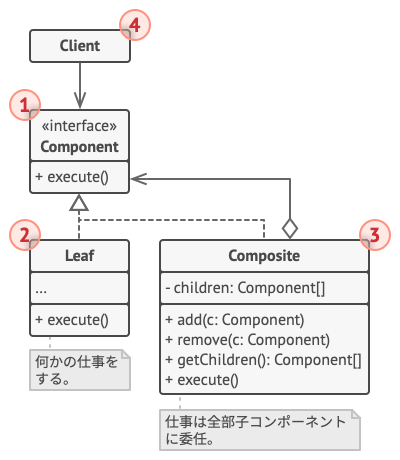

# Composite

- Pytorchの`Compose`はCompositeパターン -> データの処理を各Transformに依頼して最終的な結果を自身でまとめ上げる。

Composite(混成)は、構造に関するデザインパターンの一つで、オブジェクトからツリー構造を組み立て、そのツリー構造がまるで独立したオブジェクトであるかのように扱えるようにします。

## 😕 Problem

Compositeパターンは、アプリの中核となるモデルがツリー構造で表現できる場合にのみ適用する意味があります。

例えば、2種類のオブジェクトがあることを想像してください。`Product`と`Box`です。一つの`Box`はいくつかの`Product`と小さな`Box`を含むことができます。これらの小さな`Box`もいくつかの`Product`や小さな`Box`を含むことができ、以下同様です。

これらのクラスを使って、注文システムを作ることにしたとします。注文は、包装なしでシンプルな製品かもしれませんし、箱の中に製品と他の箱が詰め込まれたものかもしれません。このような注文の合計価格を計算するにはどうすればいいでしょう？

<div align="center">

</div>

直接的なやり方を試みることは可能です: 箱を全部開けて、製品を取り出し、合計を計算。現実世界では可能なやり方です。しかしプログラム上では、単純にループを回すだけではすみません。`Product`と`Box`クラスを熟知し、箱の入れ子の度合いその他のどうでもいい細かいことに気を払う必要があります。こういう理由で、直接の解法は、とてもやりにくかったり、不可能かもしれません。

## 😄 Solution

Compositeパターンに従うと、合計価格を計算するためのメソッドが宣言された共通のインターフェースを通して`Product`と`Box`をアクセスします。

このメソッドの仕組みはどうなっているのでしょうか？製品の場合は、単に製品の価格を返すだけです。箱の場合は、箱に含まれている各項目ごとに価格を訪ねてから、この箱の合計を返します。
項目のいずれかが小さい箱の場合、その箱もその項目などを調べる、ということをすべての内容物の価格が計算されるまで繰り返します。箱は包装手数料のような追加料金を最終的な価格に加えることもできます。

<div align="center">

</div>

このやり方の最大の利点は、ツリーを構成するオブジェクトの具象クラスを気にする必要がないことです。オブジェクトが単純な製品なのか、豪華な箱なのかを知る必要はありません。共通のインターフェースですべて同じものを扱うことができます。メソッドを呼び出すと、オブジェクト自身がリクエストをツリーの下方に渡します。

## 💻 Structure

<div align="center">

</div>

1. **コンポーネント(Component)** インターフェースは、ツリーの単純な要素と複雑な要素の両方に共通する操作を記述します。
2. **リーフ(Leaf)** は、ツリーの基本要素で、子要素を持ちません。
3. **コンテナ(Container, 別名: Composite)** は、子要素を持った要素です。コンテナはその子要素の具象クラスが何なのかを知らず、コンポーネントインターフェースを介して、子要素とやり取りをします。
4. **クライアント(Clint)** は、コンポーネントインターフェースを介してすべての要素とやり取りします。その結果、クライアントは、ツリーの単純要素と複雑な要素の両方に対して同じように機能できます。

## # Pseudo Code

この例では、Compositeパターンで、グラフィックエディターでの幾何学形状の積み重ねの実装をします。

<div align="center">

</div>

`CompoundGraphic`(複合グラフィック)クラスは、任意の数の子形状を含むコンテナです。子形状は、複合形状かもしれません。複合形状は、単純形状と同じメソッドを持っています。しかし、複合形状は、自分自身で何かを行うのではなく、リクエストをすべての個用素に渡し、結果を「集計」します。

クライアントは、すべての形状クラスに共通の単一のインターフェースを通じて、すべての形状とやり取りします。したがってクライアントは、相手が単純形状なのか複合形状なのか知りません。クライアントは、具体的なクラスと密に結合することなく、非常に複雑なオブジェクト構造を扱うことができます。

```c++
// コンポーネントインターフェースは、コンポジット中の単純なオブジェクトと複雑な
// オブジェクトの両方に共通する操作を宣言。
class Graphic {
public:
    virtual void move(int x, int y) = 0;
    virtual void draw() const = 0;
};

class Dot : public Graphic {
protected:
    int x_, y_;
public:
    Dot(int x, int y) x_(x), y_(y) { /* ... */ }

    void move(int x, int y) override {
        x_ += x;
        y_ += y;
    }

    void draw() const override { /* ... */ }
};

// すべてのコンポーネントクラスは他のコンポーネントを拡張可能。
class Circle : public Dot {
protected:
    int radius_;
public:
    Circle(int x, int y, int radius) : Dot(x, y), radius_(radius) { /* ... */ }

    void draw() const override { /* ... */ }
};

// コンポジットクラスは子を持つかもしれない複雑なコンポーネントを表現する。
// コンポジットオブジェクトは通常実際の処理を子に委任し、結果を「まとめ上げる」。
class CompositeGraphic : public Graphic {
private:
    std::vector<*Graphic> children_;
public:
    void add(const Graphic & child) { children_.emplace_back(child); }

    void remove(const Graphic & child) { }

    void move(int x, int y) override {
        for (auto & child : children_) {
            child.move(x, y);
        }
    }

    // コンポジットは、特定の方法でその主要なロジックを実行。
    // すべての子たちを再帰的に探索し、結果を収集し、まとめ上げる。
    // コンポジットの子用素が自身の子用素にこれらの呼び出しを行い、それがまたその子要素に、
    // と続くため、結果としオブジェクトツリー全体が探索される。
    void draw() const override {
        for (auto & child : children_) {
            child.draw();
        }
    }
};

class ImageEditor {
private:
    CompoundGraphic * all_;
public:
    void load() {
        all_ = new CompoundGraphic();
        all_.emplace_back(new Dot(1, 2));
        all_.emplace_back(new Circle(5, 3, 10));
        // ...
    }

    void groupSelected(const std::vector<*Graphic> & components) {
        CompoundGraphic * group = new CompoundGraphic();
        for (const auto & component : group) {
            group.emplace_back(component);
            all_.erase(component);
        }
        all_.emplace_back(group);
        all_.draw();
    }
};
```

## 💡 Applicability

🐞 ツリーのようなオブジェクト構造を実装する場合は、Compositeパターンを使用します。

⚡ Compositeパターンは、単純なリーフと複雑なコンテナという、共通のインターフェースを持った２つの基本的な要素型からなっています。
コンテナは、リーフと他のコンテナの両方から成り立っています。これにより、木に似た入れ子になった再起オブジェクト構造を構築できます。

---

🐞 クライアントコードが、単純な要素と複雑な要素を同等に扱えるようにするために、このパターンを適用してください。

⚡ Compositeパターンで定義されたすべての要素は、共通のインターフェースを共有します。このインターフェースを使用することにより、クライアントは扱うオブジェクトの具体的なクラスが何なのかを心配する必要がなくなります。

## ⚓ Pros and Cons

✅ 複雑なツリー構造をより便利に扱うことができます。多相性と再起を活用。
✅ 開放閉鎖の原則(*Open/Closed Principle*)。既存のコードを壊すことなく、オブジェクトツリーと動作可能な新規の要素型をアプリに導入可能。
❌ 機能が大きく異なるクラスの共通インターフェース作成は困難である可能性。特定の状況下では、コンポーネント・インターフェースの過度な一般化が必要で、理解困難。

## 🔄 Relations with Other Patters

- **[Builder](../../creational/builder/README.md)** は、複雑な**Composite**ツリー作成に使用できます。構築ステップを再帰的に行なうようにプログラムします。
- **[Chain of Responsibility](../../behavioral/chain-of-responsibility/README.md)** は、 よく**Composite**と一緒に使われます。 この場合、リーフ(末端)のコンポーネントがリクエストを受ける時、リクエストは、全部の親コンポーネントからオブジェクト・ツリーのルート(根)までを通るかもしれません。
- **[Iterators](../../behavioral/iterator/README.md)** を使用してCompositeツリーを探索することができます。
- **[Visitor](../../behavioral/visitor/README.md)** を使用して、Compositeツリー全体に対して一つの操作を実行できます
- RAMを節約するために、Compositeツリーの共有リーフ・ノードを **[Flyweights](../../structual/flyweight/README.md)** として実装できます。
- Compositeと **[Decorator](../decorator/README.md)** は両方とも、任意の数のオブジェクトを組織するために再起的合成を使用するので、似たような構造図をしています。
  - Decoratorは、Compositeに似ていますが、子コンポーネントは一つしかありません。もう一つの大きな違いは、Decoratorは内包するオブジェクトに責任を追加するのに対し、Composite は、単にその子たちの結果を 「まとめあげる」 だけです。
- CompositeとDecoratorを多用する設計に対しては、 **[Prototype](../../creational/prototype/README.md)** の使用が有益かもしれません。このパターンを適用すると、複雑な構造を初めから再構築するのではなく、それをクローンします。


