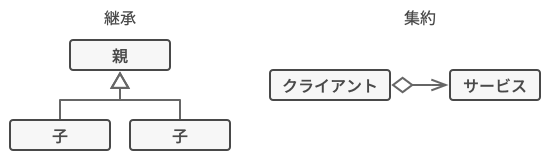

# Decorator

- Pythonのデコレータがまさにそれ。`@AnyDecorator`で関数 or クラスをラップすることで最終的にそれらを組み合わせた**新たな1つの関数 or クラス**を動的に作る。
  - Pytorchの`Compose`はCompositeパターン -> データの処理を各Transformに依頼して最終的な結果を自身でまとめ上げる。

## 📝 Intent

Decoratorはオブジェクトを特別なラッパーオブジェクトに配置することで新たな挙動を付与するデザインパターンです。

## 😕 Problem

あなたは現在重要なイベントについて通知するライブラリの開発中です。

ライブラリの初期バージョンはコンストラクタと単一の`send`メソッドフィールドしか持たない`Notifier`クラスに基づいてました。
このメソッドはクライアントからのメッセージの引数を受け取りコンストラクタ経由で渡されたメールリストに通知を送ります。
クライアントとして振る舞うサードパーティアプリは通知オブジェクトを一度だけ構築して構築し、重要なイベントが発生するごとに構築したオブジェクトを利用していました。

あるときあなたは、ユーザーはメール通知以外の利用も期待していることに気づきます。

簡単そうですね？単に`Notifier`クラスを拡張して、新しいサブクラスに追加の通知メソッドをいくつか追加すればいいです。

しかし、誰かが理にかなった質問をします。「何で一度に複数の通知タイプを使用できないんですか？家が火事になったら、全チャンネルを通して通知されたいでしょう。」

そこで、これを解決しようと、複数の通知メソッドを含む新しい特別なサブクラスを作成してみました。しかし、このやり方では、ライブラリーのコードだけでなく、クライアントのコードも非常に膨れ上がってしまうことがすぐに明らかになりました。

## 😄 Solution

クラスの拡張はオブジェクトの振る舞いを変更する必要がある際に最初に思い浮かぶことです。しかし、継承はいくつかの深刻な注意すべき点があります。

- 継承は静的です。既存のオブジェクトの振る舞いは実行時に変更できません。オブジェクト全体を別のサブクラスから作成された別のものと置き換えることのみでできます。
- サブクラスは、親クラスを一つしか持てません。ほとんどの言語では、同時に複数のクラスから振る舞いを継承することはできません。

このおうな注意点を克服する方法の一つとしては、**継承**の代わりに**集約(Aggregation)**または**合成(Composition)**を使用することです。どちらの選択もほぼ同じように機能します。あるオブジェクトが別のオブジェクト参照を一つ保持し、そのオブジェクトに仕事を委任します。継承ではオブジェクト自身がスーパクラスから振る舞いを継承し、仕事を行います。

この新しいやり方では、リンクされた「ヘルパー」オブジェクトを簡単に別のオブジェクトに置き換えることができ、実行時のコンテナの振る舞いを変更できます。オブジェクト一つから複数のオブジェクトへの参照を持ち、いろいろな種類の作業を委任することにより、様々なクラスの振る舞いを利用できます。集約と合成は、Decoratorを含む多くのデザインパターンの背後にある重要な原則です。

「Wrapper」は、Decoratorパターンのもう一つのニックネームです。このパターンの中心となるアイデアを明確に表現しています。ラッパーはターゲットオブジェクトにリンクできるオブジェクトです。ラッパーはターゲットと同じメソッドを含み、受け取ったすべてのリクエストをターゲットに委任します。しかしラッパーはリクエストをターゲットに渡す前や後に、何らかのことを行い操作することができます。