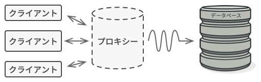

# Proxy

## 📝 Intent

Proxy(プロキシー、 代理)は、構造に関するデザインパターンの一つで、他のオブジェクトの代理、代用を提供します。
プロキシーは、元のオブジェクトへのアクセスを制御し、元のオブジェクトへリクエストが行く前か後に別の何かを行うようにすることができます。

<div align="center">

</div>

## 💡 Key Concepts

Proxy パターンでは、元のサービス・オブジェクトと同じインターフェースで新しいプロキシー・クラスを作成します。
次に、アプリを変更して、元のオブジェクトのすべてのクライアントに、プロキシーのオブジェクトを渡すようにします。
クライアントからのリクエストを受け取ると、プロキシーは実際のサービス・オブジェクトを作成し、すべての作業を委任します。

<div align="center">

</div>

1. サービス・インターフェース （Service Interface） は、 サービスのインターフェースを宣言します。 プロキシーは、 サービス・オブジェクトのふりをするために、 このインターフェースに沿わなければなりません。
2. サービス(Service)は、何らかの役に立つビジネス・ロジックを提供するクラスです。
3. プロキシー(Proxy)クラスには、サービス・オブジェクトを指す参照フィールドがあります。プロキシーの行うべき処理(たとえば、遅延初期化、ロギング、アクセス制御、キャッシュ処理など)が完了すると、プロキシーは、サービス・オブジェクトにリクエストを渡します。通常、プロキシーはサービス・オブジェクトのライフサイクルを完全に管理します。
4. クライアント(Client)は、同じインターフェースを介してサービスとプロキシーの両方で動作します。こうすることで、サービス・オブジェクトを期待するどんなコードにでもプロキシーを渡すことができます。

## 💻 Pseudo Code

<div align="center">

</div>

```java
// リモートサービスのインターフェイス
interface ThirdPartyYouTubeLib is
    method listVideos()
    method getVideoInfo(id)
    method downloadVideo(id)

// サービス・コネクターの具体的な実装。このクラスのメソッドは、YouTube か
// ら情報を要求できる。リクエストの処理速度は、ユーザーのインターネット接
// 続状況と YoutTube 側の状況に依存。同時にいくつものリクエストがあると、
// 仮に全部が同じ情報のリクエストだったとしても、アプリケーションは減速す
// る。
class ThirdPartyYouTubeClass implements ThirdPartyYouTubeLib is
    method listVideos() is
        // YouTubeにAPIリクエストを送信。

    method getVideoInfo(id) is
        // ビデオに関するメタデータの取得。

    method downloadVideo(id) is
        // YouTubeからビデオファイルをダウンロード。

// 帯域幅を節約するために、リクエストの結果をキャッシュし、しばらくの間保
// 存することが可能。しかし、そのようなコードを直接サービス・クラスに入れ
// ることは不可能な場合あり。たとえば、外部作成のライブラリーの一部として
// 提供されていたり、クラスが final と定義されていたりする場合。サービス・
// クラスと同じインターフェースを実装する新しいプロキシー・クラスを作り、
// キャッシュのためのコードを追加するのは、このため。本当のリクエストを
// 送信する時にだけ、サービス・オブジェクトにリクエストを委任する。
class CachedYouTubeClass implements ThirdPartyYouTubeLib is
    private field service: ThirdPartyYouTubeLib
    private field listCache, videoCache
    field needReset

    constructor CachedYouTubeClass(service: ThirdPartyYouTubeLib) is
        this.service = service

    method listVideos() is
        if (listCache == null || needReset)
            listCache == service.listVideos()
        return listCache

    method getVideoInfo(id) is
        if (videoCache == null || needReset)
            videoCache = service.getVideoInfo(id)
        return videoCache

    method downloadVideo(id) is
        if (!downloadExists(id) || needReset)
            service.downloadVideo(id)

// 以前はサービス・オブジェクトと直接機能していた GUI のクラスは、あるイ
// ンターフェースを通してサービス・オブジェクトと機能する限り変更不要。本
// 物のサービス・オブジェクトに代わってプロキシー・オブジェクトを安全に渡
// すことが可能。これは、両方のクラスが同じインターフェースを実装するため。
class YouTubeManager is
    protected field service: ThirdPartyYouTubeLib

    constructor YouTubeManager(service: ThirdPartyYouTubeLib) is
        this.service = service

    method renderVideoPage(id) is
        info = service.getVideoInfo(id)
        // ビデオ・ページを描画。

    method renderListPanel() is
        list = service.listVideos()
        // ビデオのサムネールをリスト表示。

    method reactOnUserInput() is
        renderVideoPage()
        renderListPanel()

// アプリケーションは、プロキシーをその場で構成可能。
class Application is
    method init() is
        aYouTubeService = new ThirdPartyYouTubeClass()
        aYouTubeProxy = new CachedYouTubeClass(aYouTubeService)
        manager = new YouTubeManager(aYouTubeProxy)
        manager.reactOnUserInput()
```

