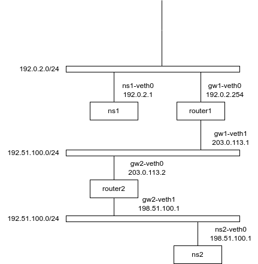

# ルータ

## ルータの追加

- ネットワーク構成


1. Network NamespaceとNetwork Interface作成
```shell
# namespace
$ sudo ip netns add ns1
$ sudo ip netns add router
$ sudo ip netns add ns2

# interface
$ sudo ip link add ns1-veth0 type veth peer name gw-veth0
$ sudo ip link add ns2-veth0 type veth peer name gw-veth1

# namespaceに追加
$ sudo ip link set ns1-veth0 netns ns1
$ sudo ip link set gw-veth0 nstns router
$ sudo ip link set gw-veth1 nstns router
$ sudo ip link set ns2-veth1 netns ns2

# state->UP
$ sudo ip netns exec ns1 ip link set ns1-veth0 up
$ sudo ip netns exec router ip link set gw-veth0 up
$ sudo ip netns exec router ip link set gw-veth1 up
$ sudo ip netns exec ns2 ip link set ns2-veth0 up

# IPアドレス付与
$ sudo ip netns exec ns1 ip address add 192.0.2.1/24 dev ns1-veth0
$ sudo ip netns exec router ip address add 192.0.2.254/24 dev gw-veth0
$ sudo ip netns exec router ip address add 198.51.100.254/24 dev gw-veth1
$ sudo ip netns exec ns2 ip address add 198.51.100.1/24 dev ns2-veth0

# 確認
$ sudo ip netns exec ns1 ip address show | grep veth
167: ns1-veth0@if166: <BROADCAST,MULTICAST,UP,LOWER_UP> mtu 1500 qdisc noqueue state UP group default qlen 1000
    inet 192.0.2.1/24 scope global ns1-veth0

$ sudo ip netns exec router ip address show | grep veth
166: gw-veth0@if167: <BROADCAST,MULTICAST,UP,LOWER_UP> mtu 1500 qdisc noqueue state UP group default qlen 1000
    inet 192.0.2.254/24 scope global gw-veth0
168: gw-veth1@if169: <BROADCAST,MULTICAST,UP,LOWER_UP> mtu 1500 qdisc noqueue state UP group default qlen 1000
    inet 198.51.100.254/24 scope global gw-veth1

$ sudo ip netns exec ns2 ip address show | grep veth
169: ns2-veth0@if168: <BROADCAST,MULTICAST,UP,LOWER_UP> mtu 1500 qdisc noqueue state UP group default qlen 1000
    inet 198.51.100.1/24 scope global ns2-veth0
```

これでns1 <-> router <-> ns2のネットワークが構成された。
現状ではns1 <-> router、router <-> ns2の通信はできるが、ns1 <-> ns2の通信はできない。

```shell
# ns1 <-> router
$ sudo ip netns exec ns1 ping -c 3 192.0.2.254
[sudo] password for ktro2828:
PING 192.0.2.254 (192.0.2.254) 56(84) bytes of data.
64 bytes from 192.0.2.254: icmp_seq=1 ttl=64 time=0.043 ms
64 bytes from 192.0.2.254: icmp_seq=2 ttl=64 time=0.062 ms
64 bytes from 192.0.2.254: icmp_seq=3 ttl=64 time=0.083 ms

--- 192.0.2.254 ping statistics ---
3 packets transmitted, 3 received, 0% packet loss, time 2036ms
rtt min/avg/max/mdev = 0.043/0.062/0.083/0.016 ms

# ns2 <-> router
$ sudo ip netns exec ns2 ping -c 3 198.51.100.254
PING 198.51.100.254 (198.51.100.254) 56(84) bytes of data.
64 bytes from 198.51.100.254: icmp_seq=1 ttl=64 time=0.020 ms
64 bytes from 198.51.100.254: icmp_seq=2 ttl=64 time=0.063 ms
64 bytes from 198.51.100.254: icmp_seq=3 ttl=64 time=0.066 ms

--- 198.51.100.254 ping statistics ---
3 packets transmitted, 3 received, 0% packet loss, time 2037ms
rtt min/avg/max/mdev = 0.020/0.049/0.066/0.021 ms

# ns1 <-> ns2
$ sudo ip netns exec ns1 ping -c 3 198.51.100.1
ping: connect: Network is unreachable
```

## ルータ越しに通信する

**ルータ越しに通信するには、ルーティングテーブルを設定する必要がある。**

```shell
# ns1のルーティングテーブル確認
$ sudo ip netns exec ns1 ip route show
192.0.2.0/24 dev ns1-veth0 proto kernel scope link src 192.0.2.1
```
ns1のルーティングテーブルには、エントリが１つだけで。192.0.2.0/24宛はns1-veth0というネットワークインターフェースで通信することしかできない。
そこで、ns1とns2にデフォルトルートとなるルーティングエントリ(=routerのIPアドレス)を追加する。

```shell
$ sudo ip netns exec ns1 ip route add default via 192.0.2.254
$ sudo ip netns exec ns2 ip route add default via 198.51.100.254
```
これでpingを送ると返答が戻ってくる（カーネルのパラメータがデフォルトで有効になっている場合）

```shell
# あえてパラメータを無効にする
$ sudo ip netns exec router sysctl net.ipv4.ip_forward=0

# 失敗する
$ sudo ip netns exec ns1 ping -c 3 198.51.100.1
PING 198.51.100.1 (198.51.100.1) 56(84) bytes of data.

--- 198.51.100.1 ping statistics ---
3 packets transmitted, 0 received, 100% packet loss, time 2029ms
```

```shell
# パラメータを有効化
$ sudo ip netns exec router sysctl net.ipv4.ip_forward=1

# 成功する
$ sudo ip netns exec ns1 ping -c 3 198.51.100.1
PING 198.51.100.1 (198.51.100.1) 56(84) bytes of data.
64 bytes from 198.51.100.1: icmp_seq=1 ttl=63 time=0.024 ms
64 bytes from 198.51.100.1: icmp_seq=2 ttl=63 time=0.078 ms
64 bytes from 198.51.100.1: icmp_seq=3 ttl=63 time=0.074 ms

--- 198.51.100.1 ping statistics ---
3 packets transmitted, 3 received, 0% packet loss, time 2026ms
rtt min/avg/max/mdev = 0.024/0.058/0.078/0.024 ms
```

## ルータを追加する

- ネットワーク構成



```shell
# Network Namespace作成
$ sudo ip netns add ns1
$ sudo ip netns add router1
$ sudo ip netns add router2
$ sudo ip netns add ns2

# Network Interface作成
$ sudo ip link add ns1-veth0 type veth peer name gw1-veth0
$ sudo ip link add gw1-veth1 type veth peer name gw2-veth0
$ sudo ip link add gw2-veth1 type veth peer name ns2-veth0

# namespaceに追加
$ sudo ip link set ns1-veth0 netns ns1
$ sudo ip link set gw1-veth0 netns router1
$ sudo ip link set gw1-veth1 netns router1
$ sudo ip link set gw2-veth0 netns router2
$ sudo ip link set gw2-veth1 netns router2
$ sudo ip link set ns2-veth0 netns ns2

# state->UP
$ sudo ip netns exec ns1 ip link set ns1-veth0 up
$ sudo ip netns exec router1 ip link set gw1-veth0 up
$ sudo ip netns exec router1 ip link set gw1-veth1 up
$ sudo ip netns exec router2 ip link set gw2-veth0 up
$ sudo ip netns exec router2 ip link set gw2-veth1 up
$ sudo ip netns exec ns2 ip link set ns2-veth0 up

# IPアドレス付与
$ sudo ip netns exec ns1 ip address add 192.0.2.1/24 dev ns1-veth0
$ sudo ip netns exec router1 ip address add 192.0.2.254/24 dev gw1-veth0
$ sudo ip netns exec router1 ip address add 203.0.113.1/24 dev gw1-veth1
$ sudo ip netns exec router2 ip address add 203.0.113.2/24 dev gw2-veth0
$ sudo ip netns exec router2 ip address add 198.51.100.1/24 dev gw2-veth1
$ sudo ip netns exec ns2 ip address add 198.51.100.1/24 dev ns2-veth0

# ルーティングエントリの追加
$ sudo ip netns exec ns1 ip route add default via 192.0.2.254
$ sudo ip netns exec ns2 ip route add default via 198.51.100.254
$ sudo ip netns exec router1 ip route add 198.51.100.0/24 via 203.0.113.2 # defaultでも可
$ sudo ip netns exec router2 ip route add 192.0.2.0/24 via 203.0.113.1 # defaultでも可
```
